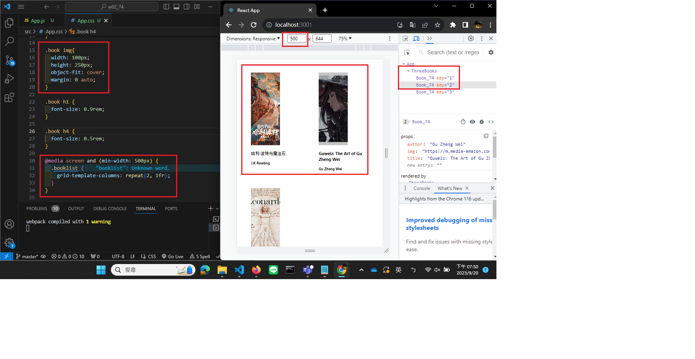
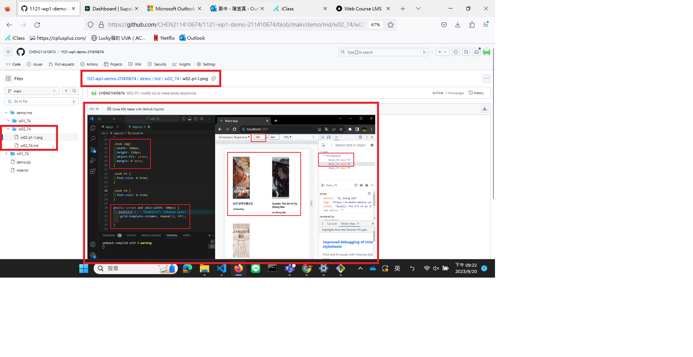
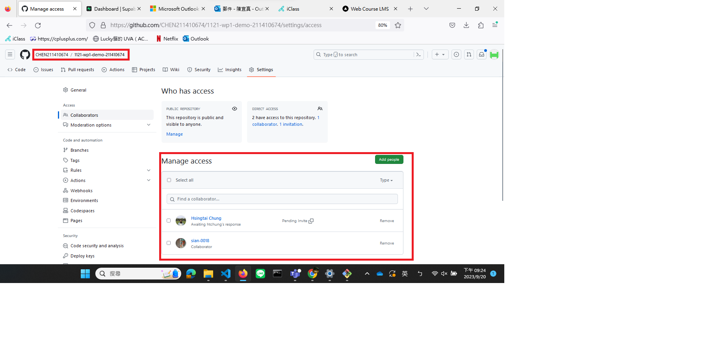
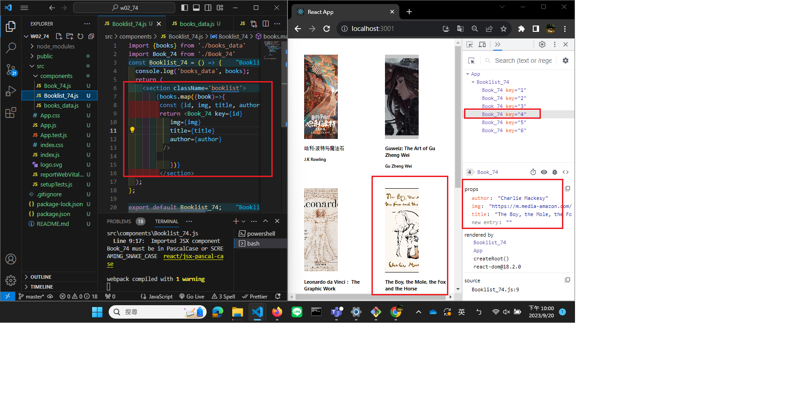
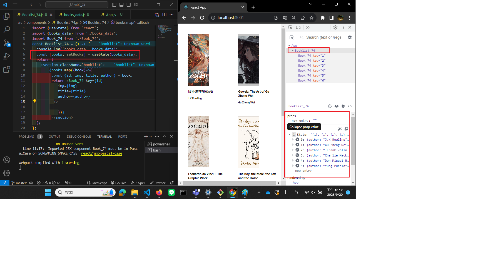

[My Github Repo URL](https://github.com/CHEN211410674/1121-wp1-demo-211410674.git)

### W02-P1: modify css to make books responsive
 




### W02-P2: share Github repo to the teacher and TA
 


### W02-P3: Use <Booklist_xx> to show all books in books_data.js array


### W02-P4: Use useState hook to store all books in books_data.js array
 


```
 git log --pretty=format:"%h%x09%an%x09%ad%x09%s" --after="2023-09-19"
3cd4a5b CHEN211410674   Wed Sep 20 22:13:35 2023 +0800  W02-P4: Use useState hook to store all books in books_data.js array
777a0e2 CHEN211410674   Wed Sep 20 22:03:20 2023 +0800  W02-P3: Use <Booklist_xx> to show all books in books_data.js array      
4e6ec17 CHEN211410674   Wed Sep 20 21:33:10 2023 +0800  W01-P4: Display three different <Book_xx />, and show third <Book_xx> in Chrome DevTools(忘記放截圖)
af2e43b CHEN211410674   Wed Sep 20 21:26:22 2023 +0800  W02-P2: share Github repo to the teacher and TA
0b5f948 CHEN211410674   Wed Sep 20 21:20:09 2023 +0800  W02-P1: modify css to make books responsive
c45660e CHEN211410674   Wed Sep 20 18:40:06 2023 +0800  ### W01-P4: Display three different <Book_xx />, and show third <Book_xx> in Chrome DevTools
```