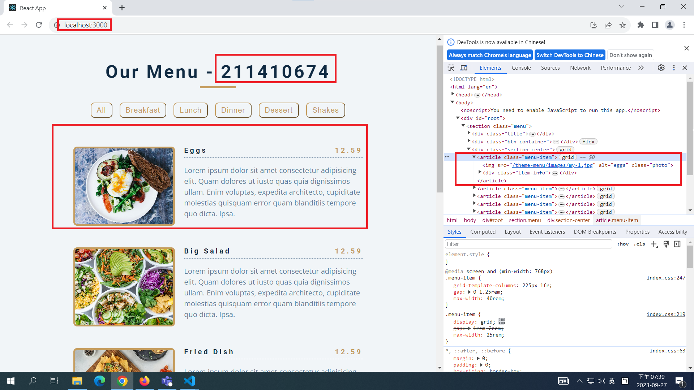
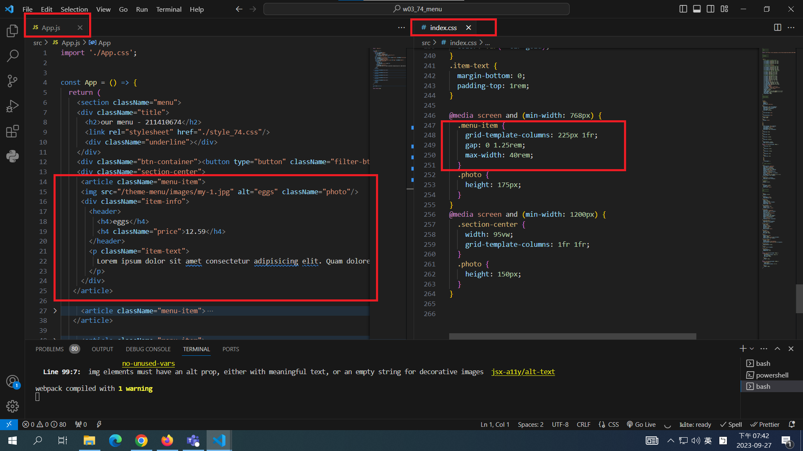
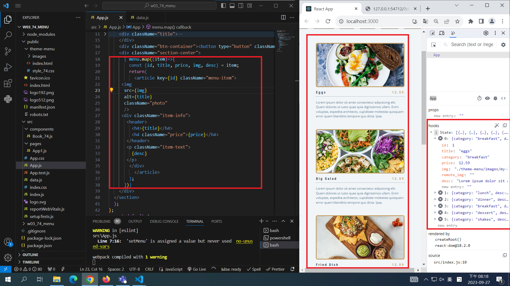
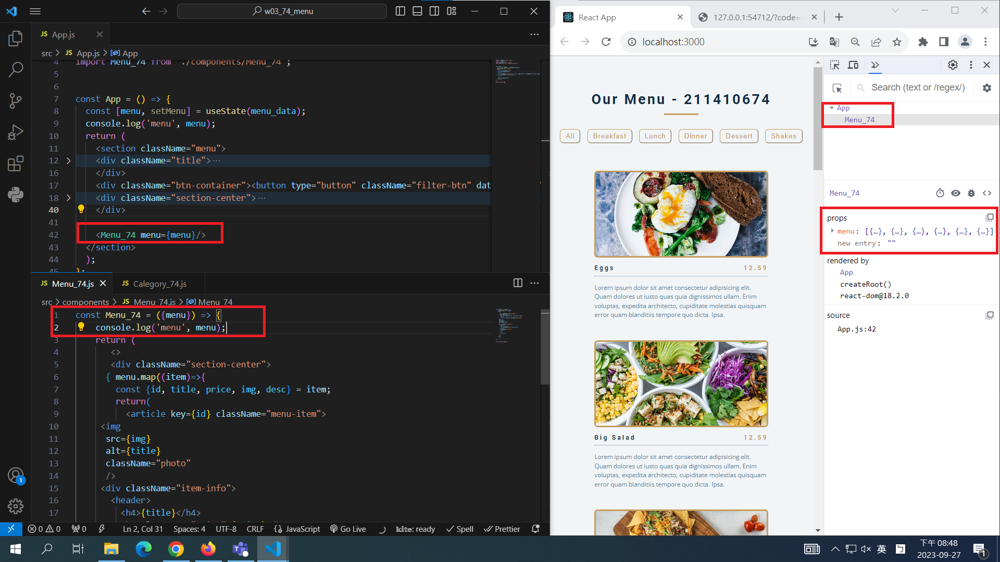
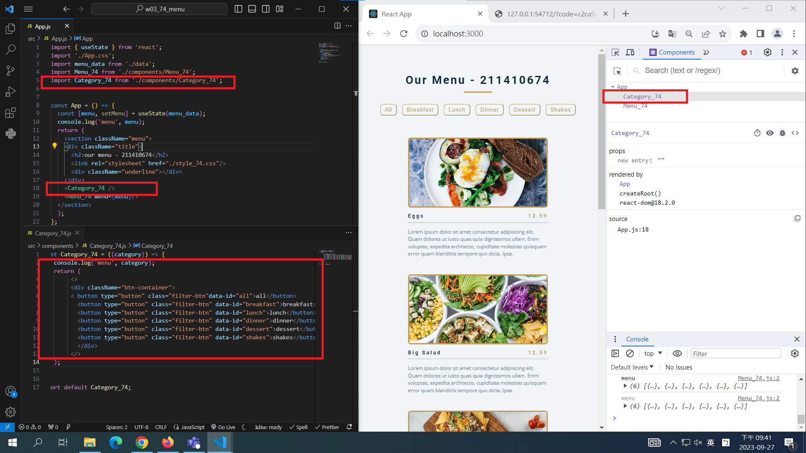
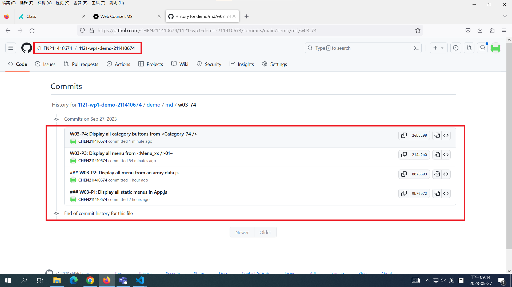

[My Github Repo URL](https://github.com/CHEN211410674/1121-wp1-demo-211410674.git)

### W03-P1: Display all static menus in App.js





```
9b76b72 CHEN211410674   Wed Sep 27 19:45:09 2023 +0800  ### W03-P1: Display all static menus in App.js
```

### W03-P2: Display all menu from an array data.js



```
8076609 CHEN211410674   Wed Sep 27 20:19:52 2023 +0800  ### W03-P2: Display all menu from an array data.js
```

### W03-P3: Display all menu from <Menu_74 />



```
214d2a0 CHEN211410674   Wed Sep 27 20:49:47 2023 +0800  W03-P3: Display all menu from <Menu_xx />01~
```

### W03-P4: Display all category buttons from <Category_74 />



```
2eb8c98 CHEN211410674   Wed Sep 27 21:43:16 2023 +0800  W03-P4: Display all category buttons from <Category_74 />
```

### W03-P5: show all git logs of W3



```
c280ef2 CHEN211410674   Wed Sep 27 21:45:25 2023 +0800  W03-P5: show all git logs of W3
2eb8c98 CHEN211410674   Wed Sep 27 21:43:16 2023 +0800  W03-P4: Display all category buttons from <Category_74 />
214d2a0 CHEN211410674   Wed Sep 27 20:49:47 2023 +0800  W03-P3: Display all menu from <Menu_xx />01~
8076609 CHEN211410674   Wed Sep 27 20:19:52 2023 +0800  ### W03-P2: Display all menu from an array data.js
9b76b72 CHEN211410674   Wed Sep 27 19:45:09 2023 +0800  ### W03-P1: Display all static menus in App.js

```
