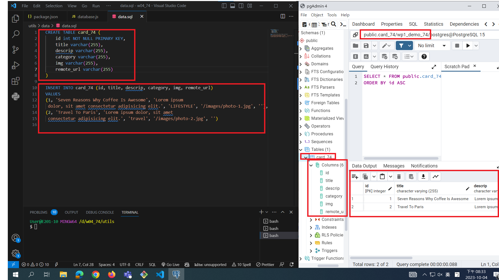
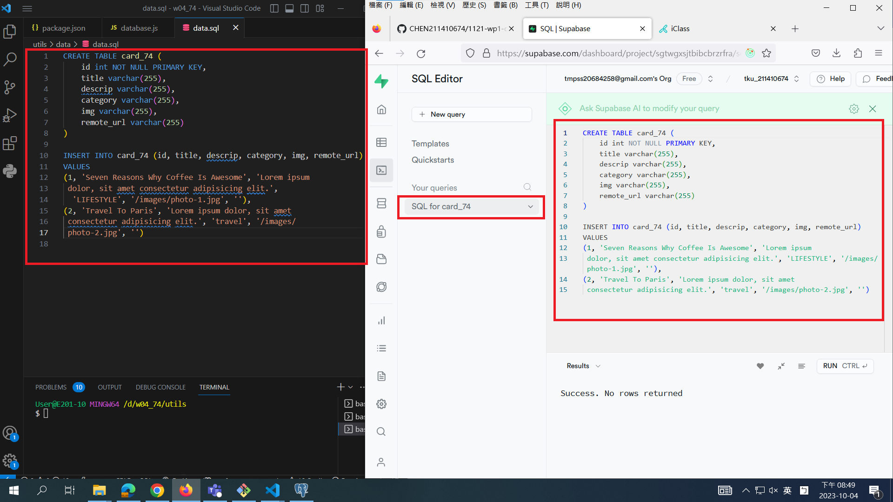
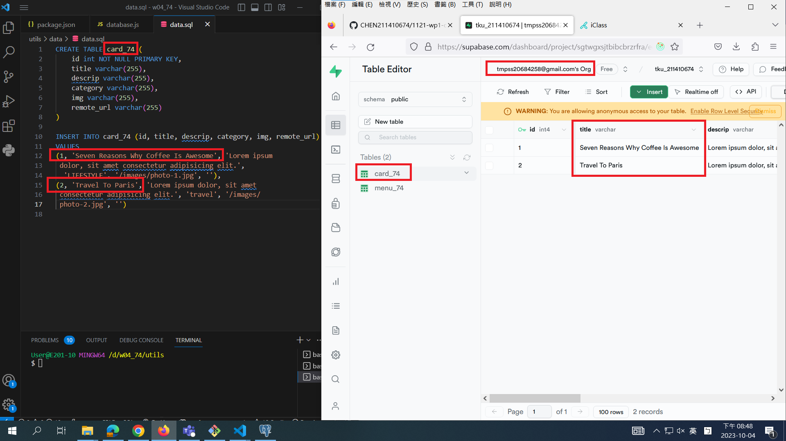

[My Github Repo URL](https://github.com/CHEN211410674/1121-wp1-demo-211410674.git)

### W04-P1: Connect database wp1_demo_74


```
6b4855e CHEN211410674   Wed Oct 4 19:41:37 2023 +0800   W04-P1: Connect database wp1_demo_74
```

### W04-P2: Using SQL to create table card_74, and insert two data



```
419ca42 CHEN211410674   Wed Oct 4 20:35:29 2023 +0800   W04-P2: Using SQL to create table card_74, and insert two data
```

### W04-P3: Using Supabase SQL editor to create table card_xx, and insert two data




