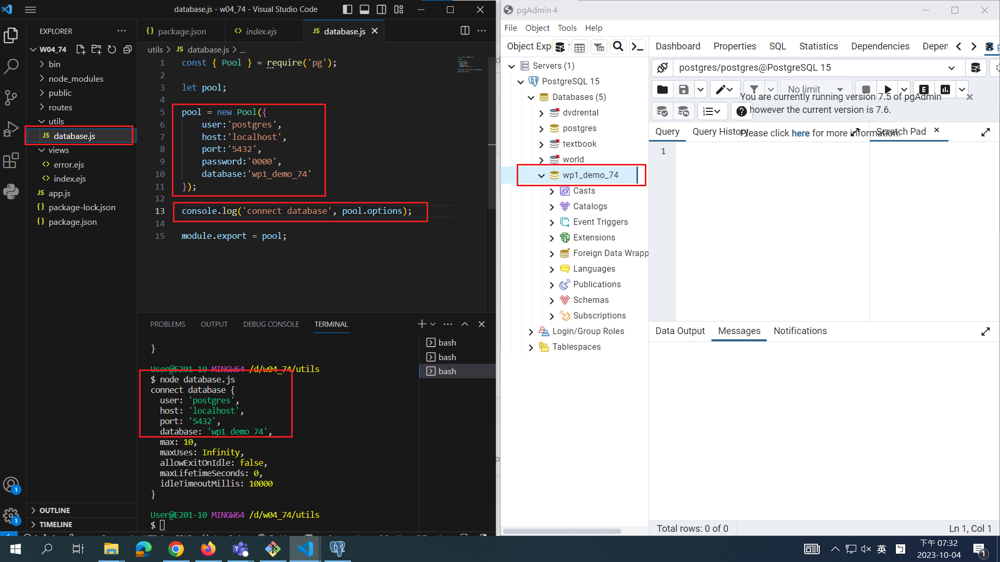

[My Github Repo URL](https://github.com/CHEN211410674/1121-wp1-demo-211410674.git)

### W04-P1: Connect database wp1_demo_74



```
6b4855e CHEN211410674   Wed Oct 4 19:41:37 2023 +0800   W04-P1: Connect database wp1_demo_74
```

### W04-P2: Using SQL to create table card_74, and insert two data


```
419ca42 CHEN211410674   Wed Oct 4 20:35:29 2023 +0800   W04-P2: Using SQL to create table card_74, and insert two data
```

### W04-P3: Using Supabase SQL editor to create table card_xx, and insert two data


```
1c33e13 CHEN211410674   Wed Oct 4 20:50:43 2023 +0800   W04-P3: Using Supabase SQL editor to create table card_xx, and insert two data
```

### W04-P4: Use JavaScript code to get card_xx data from local wp1_demo_74 database


```
3c2a556 CHEN211410674   Wed Oct 4 21:20:35 2023 +0800   W04-P4: Use JavaScript code to get card_xx data from local wp1_demo_74 database
```

### W04-P5: Show 9 data in both local PostgreSQL and Supabase

#### local PostgreSQL


#### Supabase


