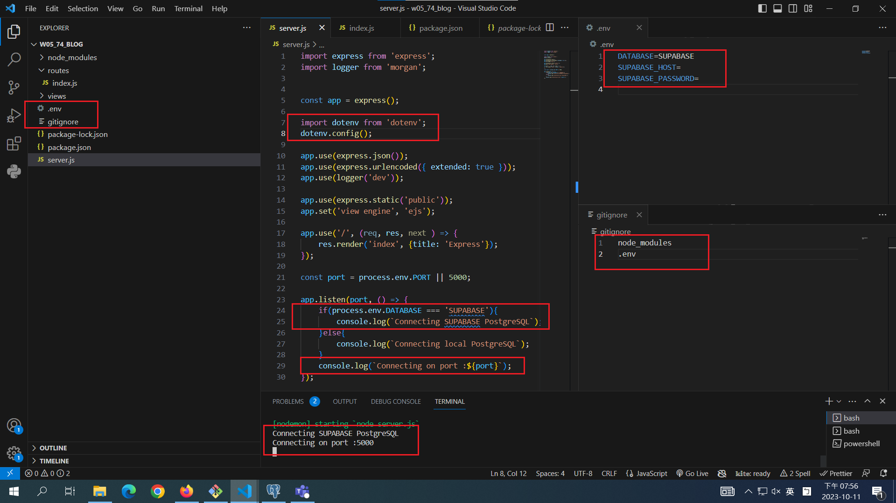
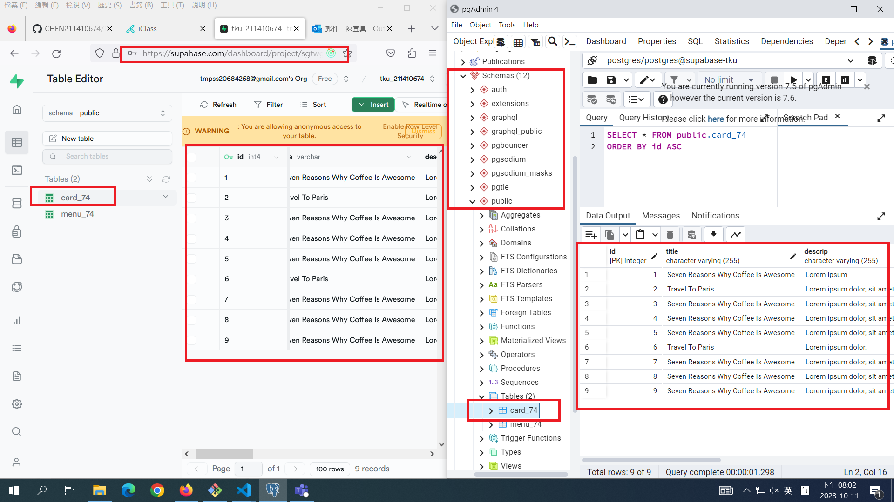
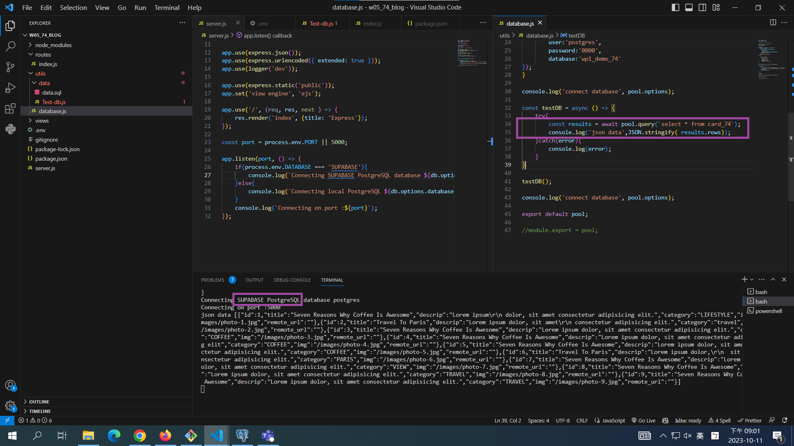
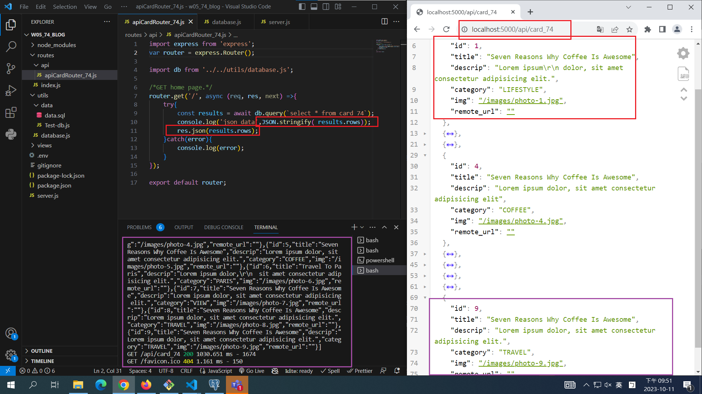

[My Github Repo URL](https://github.com/CHEN211410674/1121-wp1-demo-211410674.git)

### W05-P1: Demo how to use environment variable DATABASE



```
4361ba6 CHEN211410674   Wed Oct 11 20:07:32 2023 +0800  W05-P1: Demo how to use environment variable DATABASE
```

### W05-P2: Using pgAdmin 4 to get table card_xx from Supabase



```
4729d12 CHEN211410674   Wed Oct 11 20:27:35 2023 +0800  W05-P2: Using pgAdmin 4 to get table card_74 from Supabase
```

### W05-P3: Using database.js to connect to Supabase and show card_74 data



```
0b91083 CHEN211410674   Wed Oct 11 21:11:32 2023 +0800  W05-P3: Using database.js to connect to Supabase and show card_74 data
```

### W04-P4: For route /api/card_74, get Json data from Supabase



```
api/card_74, get Json data from Supabase
```

### W05-P5: W5 all logs

```
git log --pretty=format:"%h%x09%an%x09%ad%x09%s" --after="2023-10-10"
8dc0f4a CHEN211410674   Wed Oct 11 21:53:36 2023 +0800  W04-P4: For route /api/card_74, get Json data from Supabase
0b91083 CHEN211410674   Wed Oct 11 21:11:32 2023 +0800  W05-P3: Using database.js to connect to Supabase and show card_74 data
4729d12 CHEN211410674   Wed Oct 11 20:27:35 2023 +0800  W05-P2: Using pgAdmin 4 to get table card_74 from Supabase
4361ba6 CHEN211410674   Wed Oct 11 20:07:32 2023 +0800  W05-P1: Demo how to use environment variable DATABASE
```
