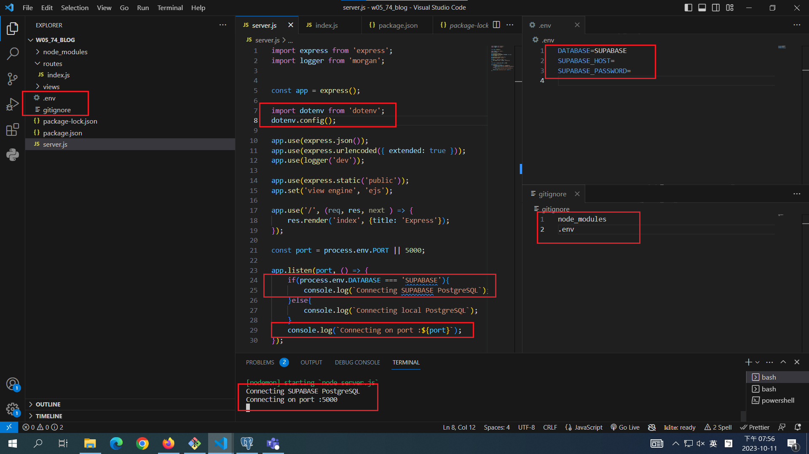
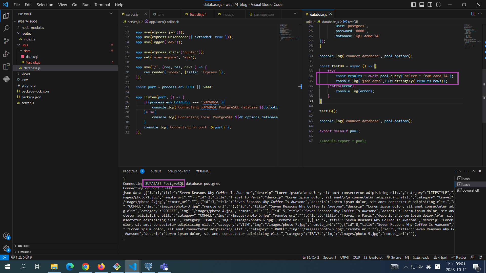

[My Github Repo URL](https://github.com/CHEN211410674/1121-wp1-demo-211410674.git)

### W05-P1: Demo how to use environment variable DATABASE

### W05-P2: Using pgAdmin 4 to get table card_xx from Supabase

### W05-P3: Using database.js to connect to Supabase and show card_74 data

### W04-P4: For route /api/card_74, get Json data from Supabase

