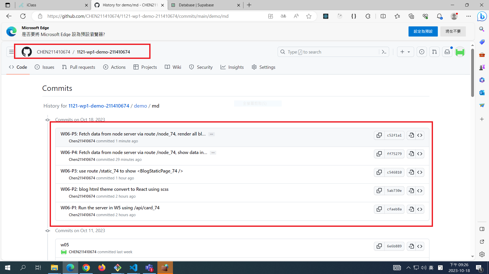

[My Github Repo URL](https://github.com/CHEN211410674/1121-wp1-demo-211410674.git)

Video: ### W06-P1: Run the server in W5 using /api/card_74


```
cfaeb8a Chen211410674   Wed Oct 18 18:47:22 2023 +0800  W06-P1: Run the server in W5 using /api/card_74

```

### W06-P2: blog html theme convert to React using scss


```
5ab730e Chen211410674   Wed Oct 18 19:26:25 2023 +0800  W06-P2: blog html theme convert to React using scss

```

### W06-P3: use route /static_74 to show <BlogStaticPage_74 />


```
c546810 Chen211410674   Wed Oct 18 20:11:28 2023 +0800   W06-P3: use route /static_74 to show <BlogStaticPage_74 />

```

### W06-P4: Fetch data from node server via route /node_74, show data in console.log


ff75279 Chen211410674 Wed Oct 18 20:56:24 2023 +0800 W06-P4: Fetch data from node server via route /node_74, show data in console.log

### W06-P5: Fetch data from node server via route /node_74, render all blogs data in webpage


```
c52f1a1 Chen211410674   Wed Oct 18 21:25:02 2023 +0800  W06-P5: Fetch data from node server via route /node_74, render all blogs
data in webpage

```

### W06-P6: W6 all logs



```
75d652f Chen211410674   Wed Oct 18 21:37:23 2023 +0800  w06
9830d3c Chen211410674   Wed Oct 18 21:28:02 2023 +0800  W06-P6: W6 all logs
c52f1a1 Chen211410674   Wed Oct 18 21:25:02 2023 +0800  W06-P5: Fetch data from node server via route /node_74, render all blogs
data in webpage
ff75279 Chen211410674   Wed Oct 18 20:56:24 2023 +0800   W06-P4: Fetch data from node server via route /node_74, show data in console.log
c546810 Chen211410674   Wed Oct 18 20:11:28 2023 +0800   W06-P3: use route /static_74 to show <BlogStaticPage_74 />
5ab730e Chen211410674   Wed Oct 18 19:26:25 2023 +0800  W06-P2: blog html theme convert to React using scss
cfaeb8a Chen211410674   Wed Oct 18 18:47:22 2023 +0800  W06-P1: Run the server in W5 using /api/card_74

```
