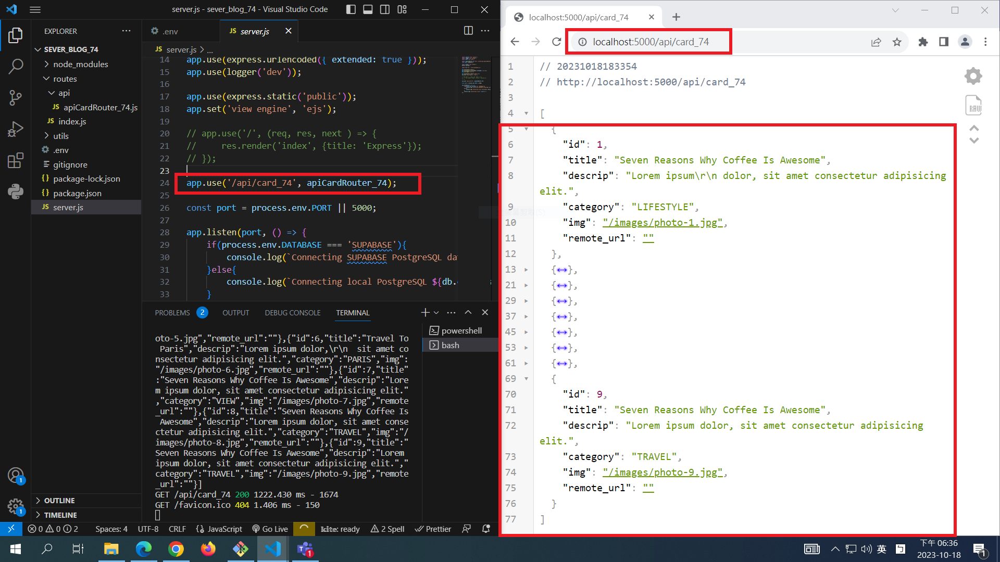
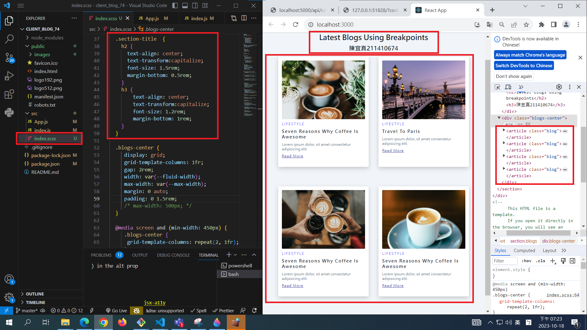
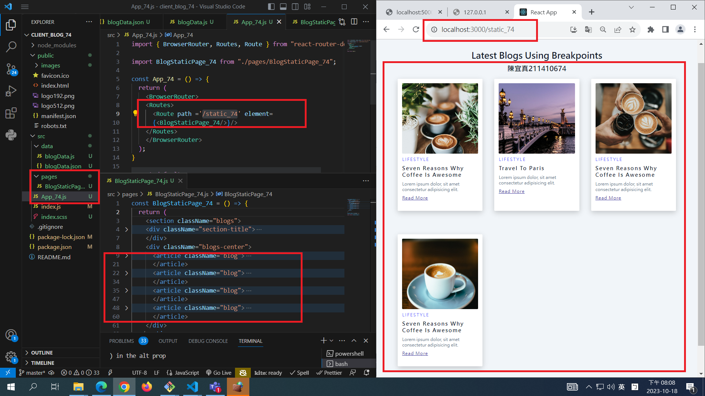
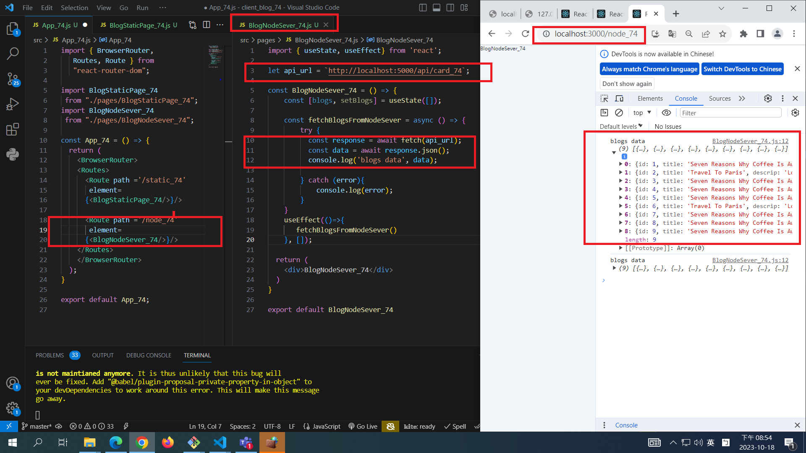
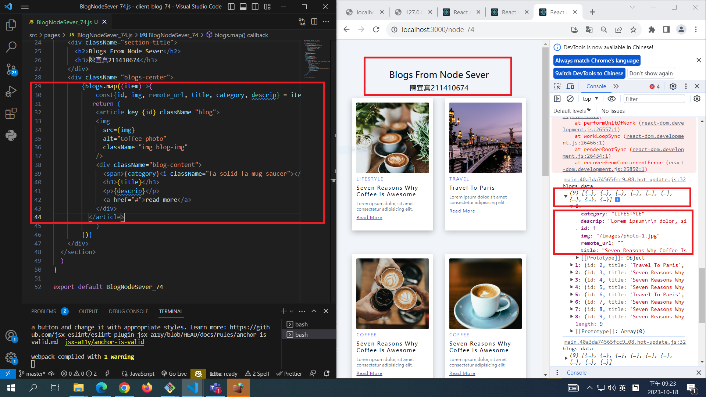

[My Github Repo URL](https://github.com/CHEN211410674/1121-wp1-demo-211410674.git)

Video: ### W06-P1: Run the server in W5 using /api/card_74

### W06-P2: blog html theme convert to React using scss

### W06-P3: use route /static_74 to show <BlogStaticPage_74 />

### W06-P4: Fetch data from node server via route /node_74, show data in console.log

### W06-P5: Fetch data from node server via route /node_74, render all blogs data in webpage

