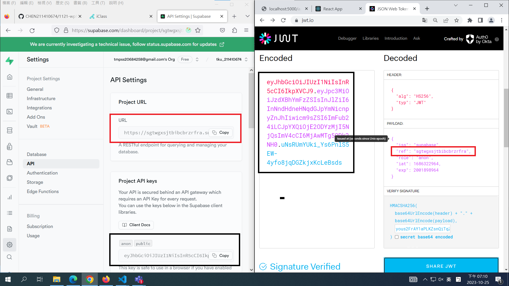
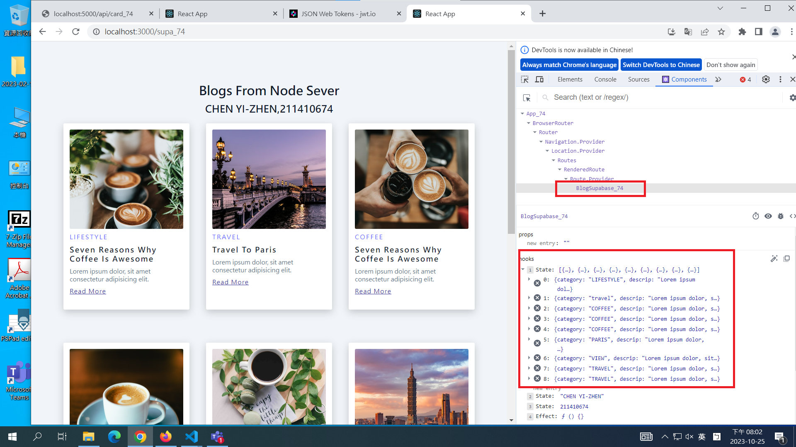
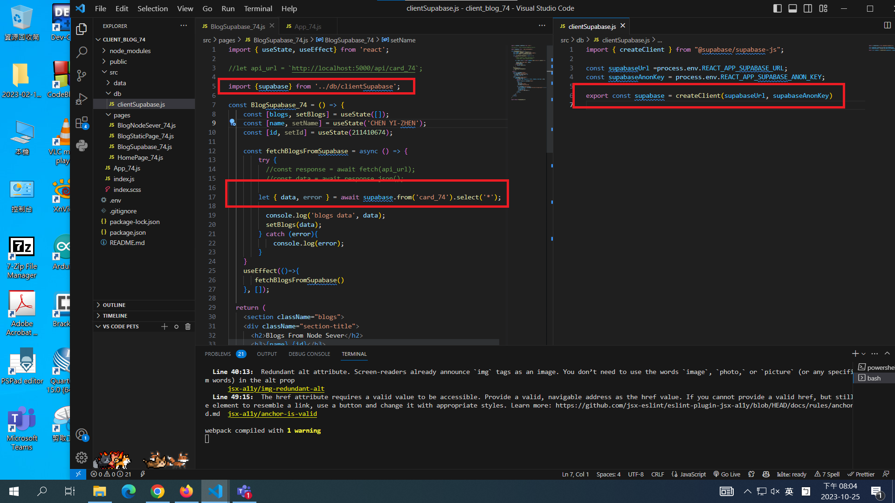
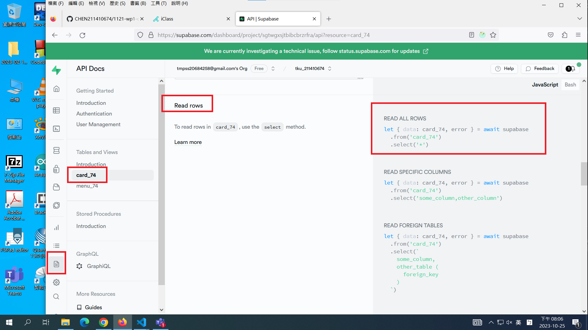

[My Github Repo URL](https://github.com/CHEN211410674/1121-wp1-demo-211410674.git)

### W07-P1: jwt introduction using anon key in Supabase

### W07-P2: Fetch blog data from Supabase

### W07-P3: Deploy to vercel, using /supa_74 to get blogs from Supabase
