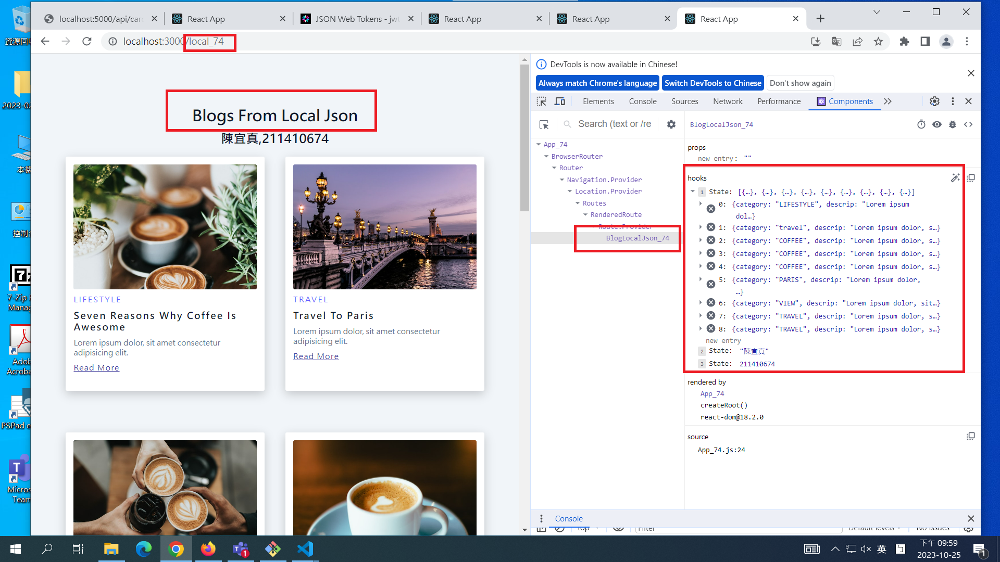

[My Github Repo URL](https://github.com/CHEN211410674/1121-wp1-demo-211410674.git)

### W07-P1: jwt introduction using anon key in Supabase


```

7a96c7e Chen211410674   Wed Oct 25 19:15:39 2023 +0800  W07-P1: jwt introduction using anon key in Supabase
```

### W07-P2: Fetch blog data from Supabase


```

d78ffa9 Chen211410674   Wed Oct 25 20:07:49 2023 +0800  W07-P2: Fetch blog data from Supabase
```

### W07-P3: Deploy to vercel, using /supa_74 to get blogs from Supabase


```
2639d61 Chen211410674   Wed Oct 25 20:49:22 2023 +0800  W07-P3: Deploy to vercel, using /supa_74 to get blogs from Supabase

```

### W07-P4: Implement BlogLocalJson_xx.js to fetch blogs from json data




```
2a731ce Chen211410674   Wed Oct 25 22:01:46 2023 +0800  W07-P4: Implement BlogLocalJson_xx.js to fetch blogs from json data
```

### W07-P5: W7 all logs


```
git log --pretty=format:"%h%x09%an%x09%ad%x09%s" --after="2023-10-24"
2a731ce Chen211410674   Wed Oct 25 22:01:46 2023 +0800  W07-P4: Implement BlogLocalJson_xx.js to fetch blogs from json data
756babc Chen211410674   Wed Oct 25 20:53:26 2023 +0800  W07-P3: Deploy to vercel, using /supa_74 to get blogs from Supabase
2639d61 Chen211410674   Wed Oct 25 20:49:22 2023 +0800  W07-P3: Deploy to vercel, using /supa_74 to get blogs from Supabase
d78ffa9 Chen211410674   Wed Oct 25 20:07:49 2023 +0800  W07-P2: Fetch blog data from Supabase
7a96c7e Chen211410674   Wed Oct 25 19:15:39 2023 +0800  W07-P1: jwt introduction using anon key in Supabase

```
