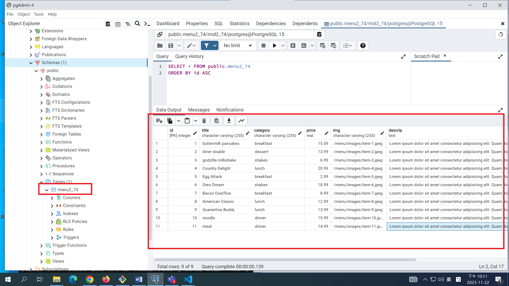
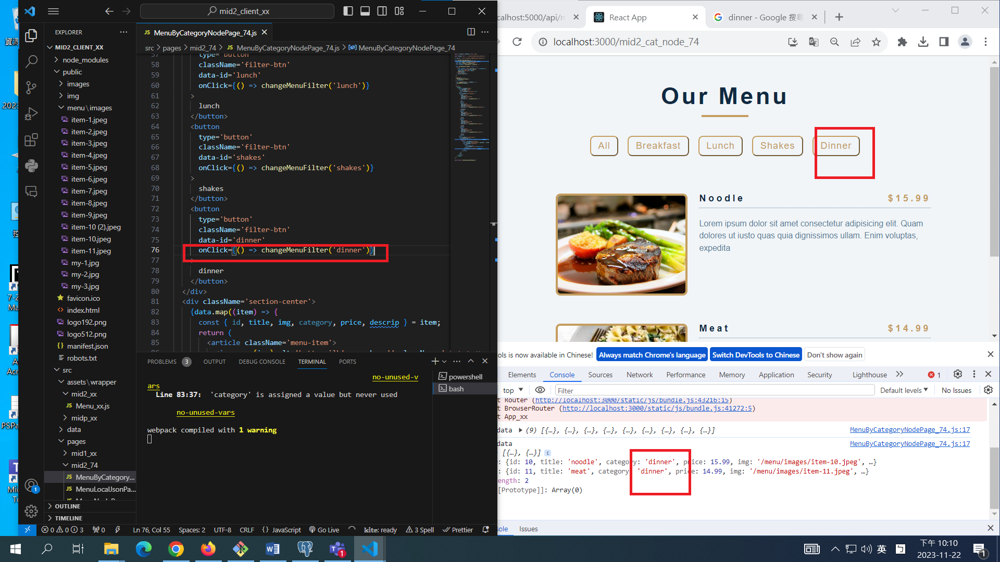

[My Github Repo URL](https://github.com/CHEN211410674/1121-wp1-demo-211410674.git)

### W11-P1: implement /api/mid2_74/menu_74/:category


```
c32c445 Chen211410674   Wed Nov 22 19:53:42 2023 +0800  W11-P1: implement /api/mid2_74/menu_74/:category
```

Video: ### W11-P2: implement /mid2_node_xx in React to get menu data from Node server


```
48f2b26 Chen211410674   Wed Nov 22 22:01:55 2023 +0800   W11-P2: implement /mid2_node_xx in React to get menu data from Node server
```

### W11-P3: implement /mid2_cat_node_xx in React to get category data from Node server


```
97f6214 Chen211410674   Wed Nov 22 22:12:50 2023 +0800   W11-P3: implement /mid2_cat_node_xx in React to get category data from Node server
```

### W11-P4: Create two menu data with category 'dinner', and get these two data from React 'Dinner' button

#### => in pgAdmin, show two newly added data



#### => in React, show two newly added data by pressing Dinner button



```
1c41b7c Chen211410674   Wed Nov 22 22:14:10 2023 +0800   W11-P4: Create two menu data with category 'dinner', and get these two data from React 'Dinner' button

```

### W011-P5: W7 all logs


```
a1efb63 Chen211410674   Wed Nov 22 22:15:55 2023 +0800   W011-P5: W7 all logs
```
