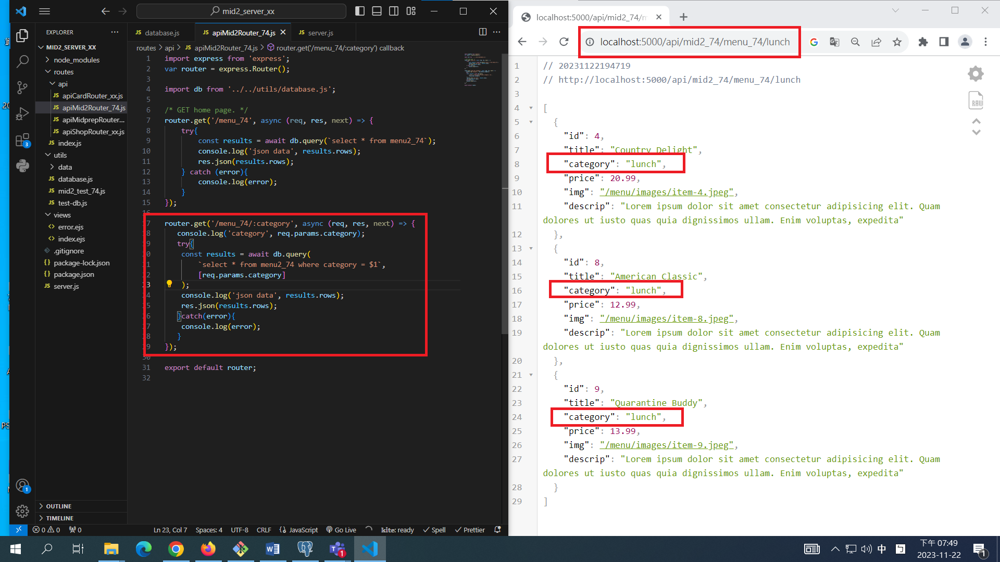
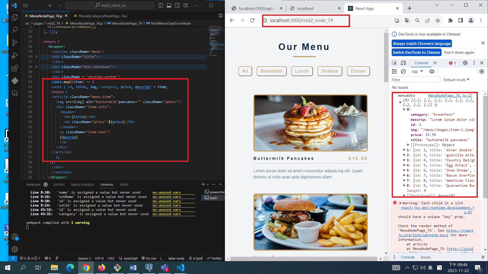
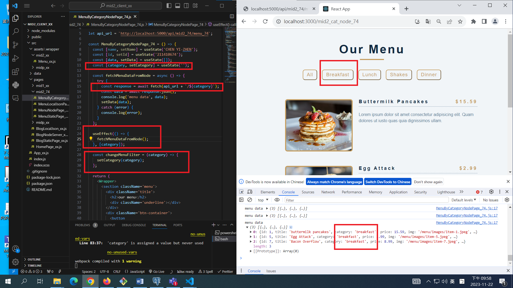
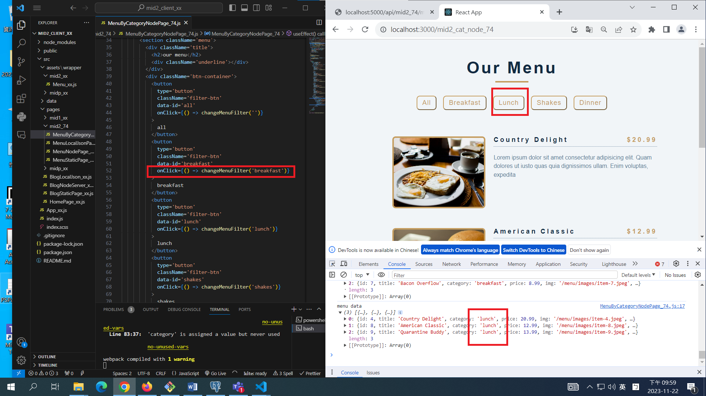
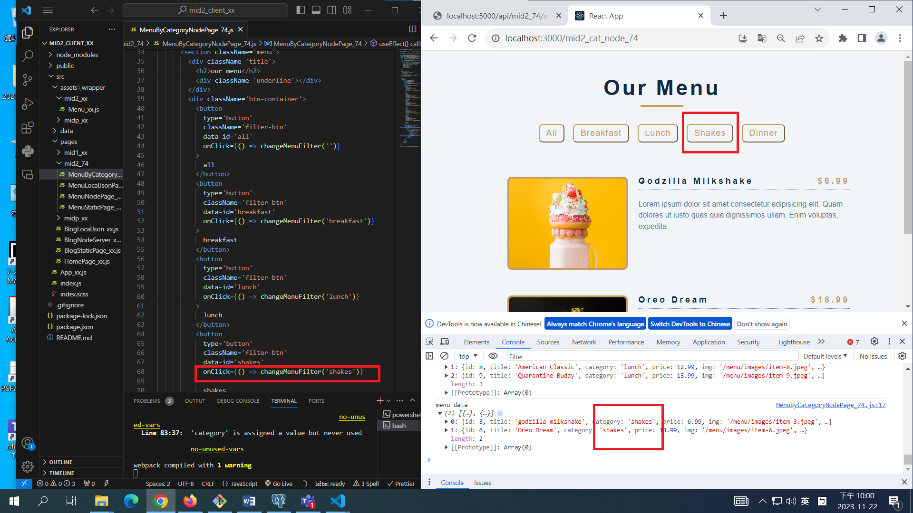
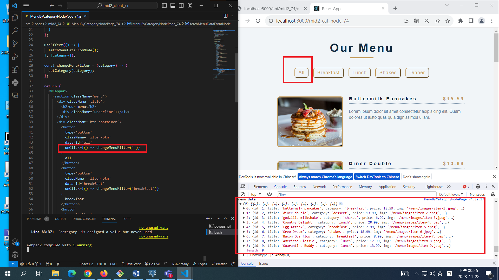

[My Github Repo URL](https://github.com/CHEN211410674/1121-wp1-demo-211410674.git)

### W11-P1: implement /api/mid2_74/menu_74/:category

Video: ### W11-P2: implement /mid2_node_xx in React to get menu data from Node server

### W11-P3: implement /mid2_cat_node_xx in React to get category data from Node server

