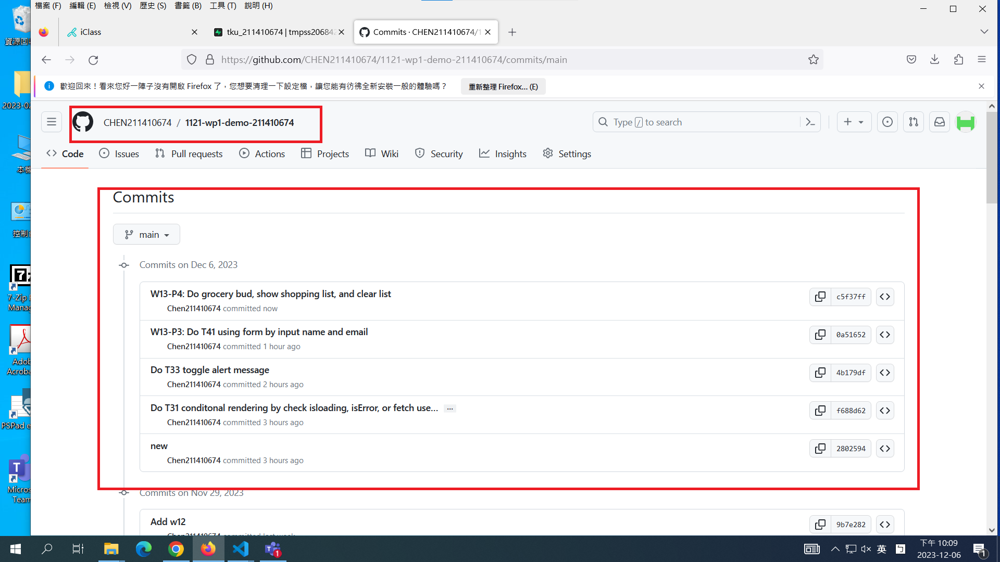

[My Github Repo URL](https://github.com/CHEN211410674/1121-wp1-demo-211410674.git)

W13-P1: Do T31 conditonal rendering by check isloading, isError, or fetch user data correctly


```
f688d62 Chen211410674   Wed Dec 6 19:10:38 2023 +0800   Do T31 conditonal rendering by check isloading, isError, or fetch user data correctly

```

### W13-P2: Do T33 toggle alert message


```
4b179df Chen211410674   Wed Dec 6 19:35:22 2023 +0800   Do T33 toggle alert message

```

### W13-P3: Do T41 using form by input name and email


```
0a51652 Chen211410674   Wed Dec 6 20:26:29 2023 +0800   W13-P3: Do T41 using form by input name and email
```

### W13-P4: Do grocery bud, show shopping list, and clear list


```
c5f37ff Chen211410674   Wed Dec 6 22:08:46 2023 +0800   W13-P4: Do grocery bud, show shopping list, and clear list
```

### W13-P5: W13 git logs



```
c5f37ff Chen211410674   Wed Dec 6 22:08:46 2023 +0800   W13-P4: Do grocery bud, show shopping list, and clear list
0a51652 Chen211410674   Wed Dec 6 20:26:29 2023 +0800   W13-P3: Do T41 using form by input name and email
4b179df Chen211410674   Wed Dec 6 19:35:22 2023 +0800   Do T33 toggle alert message
f688d62 Chen211410674   Wed Dec 6 19:10:38 2023 +0800   Do T31 conditonal rendering by check isloading, isError, or fetch user data correctly
2802594 Chen211410674   Wed Dec 6 18:16:30 2023 +0800   new
```
